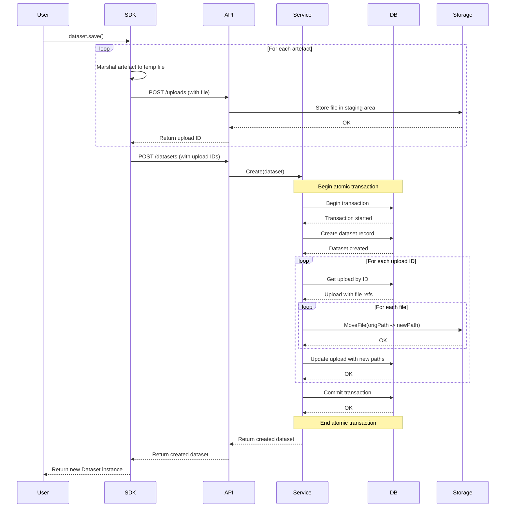

# Traintrack

Traintrack is a modular MLOps platform designed to manage and monitor the full lifecycle of machine learning workflows — from dataset tracking to deployment — with a robust Go-based backend and an easy-to-use Python SDK.

**Note, this is still very much in active development so nothing is stable. Use at your own risk.**

## 🚀 Features
- Modular Backend in Go
  Built for scale and clarity, Traintrack’s core is structured under a backplane/ directory, separating concerns cleanly.

- Python SDK
  Simplifies dataset management and future ML pipeline interactions. Ideal for data scientists and ML engineers.

- Dataset Tracking (Alpha)
  Track versions, metadata, and lineage of datasets across your team or projects.

- Designed for Multi-tenant Systems
  Secure and flexible, with SCIM auto-provisioning on the roadmap.


## 🧱 Architecture
- `backplane/` – Core Go services organized by domain
- `python-sdk/` – Python SDK modules (starting with datasets)


As the backplane can plug in a number of storage providers, the SDK routes all data through the API. To ensure atomicity, there is a two step process for creating a dataset. 

1) Uploads the artefacts (csv, text, binary) to a temporary staging location
2) Create a dataset and move the artefacts to their forever home.



## 🐍 Python SDK Usage

Install: 

```
pip install traintrack
```

Use: 

```
from traintrack import list_datasets, Dataset

client = Client(api_key="your-api-key")

# Create a new dataset version
dataset = Dataset(
    name="customer_churn",
    description="export from CRM",
    version="1.0.0",
)

# List all datasets
datasets = client.datasets.list()

# Manipulate the dataset and commit as a new version
new_dataset = dataset.transform(name="customer_churn", description="drop NaNs", version="1.0.1", lambda ...:...) 
new_dataset.save()
```

## 📦 Install & Run (Backend)

```
cd backplane/
go run ./...
```

Environment variables:

`TRAINTRACK_DB_URL` – PostgreSQL connection string

`TRAINTRACK_PORT` – Port to run the API server on

## 📅 Roadmap
- [ ] Dataset tracking (Go backend + Python SDK)

- [ ] Model versioning

- [ ] Pipeline tracking and DAG visualization

- [ ] Role-based access control

- [ ] SCIM integration

- [ ] Web UI

## 🤝 Contributing
Traintrack is early-stage and open to collaborators. Start by opening an issue or submitting a small PR.

## 📄 License
MIT
