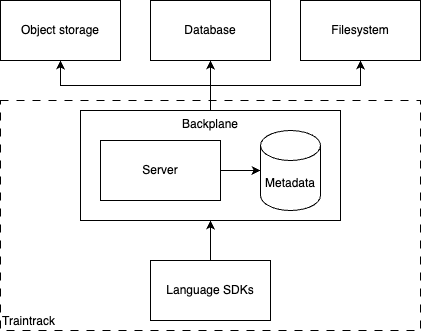

# 🚅 Traintrack

Traintrack is a modular MLOps platform designed to manage and monitor the full lifecycle of machine learning workflows — from dataset tracking to deployment — with a robust Go-based backend and an easy-to-use Python SDK.

**Note, this is still very much in active development so nothing is stable. Use at your own risk.**

## 🚀 Features

- Python SDK
  Simplifies dataset management and future ML pipeline interactions. Ideal for data scientists and ML engineers.

- Dataset Tracking
  Track versions, metadata, and lineage of datasets across your team or projects.

- Model Tracking
  Track versions, metadata, and lineage of models across your team or projects. The code used to train the model and details of the environment are stored to ensure reproducability further down the track.

- Designed for Multi-tenant Systems
  Secure and flexible, with SCIM auto-provisioning on the roadmap.


## 🌍 Set up environment

Install the CLI tool:

```
brew tap heldtogether/tools
brew install traintrack
```

Configure:

First, tell it where your instance can be found:

```
traintrack set-instance <url>
```

Then log in:

```
traintrack login
```

After adding the config, the SDK will take over and ensure that tokens are refreshed.


## 🐍 Python SDK Usage

Install the library: 

```
pip install traintrack
```

### Create a dataset

```python
from traintrack import list_datasets, Dataset

# Create a dataset
data = {
    "Bedrooms": [2, 3, 3, 4, 2, None, 4, 3, 5, 2, 4],
    "Bathrooms": [1, 2, 1, 3, 1, 2, 2, 2, 3, 1, 2],
    "Sqft": [900, 1500, 1200, 2000, 950, 1200, 1850, 1400, 2500, 1000, 2100],
    "Age": [30, 15, 20, 5, 40, 15, 10, 12, 4, 35, 8],  # years
    "Price": [200_000, 340_000, 275_000, 500_000, 210_000, None, 480_000, 320_000, 600_000, 205_000, 520_000],
}

df = pd.DataFrame(data)

X = df[["Bedrooms", "Bathrooms", "Sqft", "Age"]]
y = df[["Price"]]
X_train, X_test, y_train, y_test = train_test_split(X, y, test_size=0.2, random_state=42)

dataset = Dataset(None, "house_prices", "1.0.0", "Raw data")
dataset.set_artefact("input_features_train", X_train)
dataset.set_artefact("output_train", y_train)
dataset.set_artefact("input_features_test", X_test)
dataset.set_artefact("output_test", y_test)
dataset.save()
# dataset = <Dataset house_prices:1.0.0> 
```

### Up-version a dataset

```python
# List all datasets
datasets = list_datasets()
dataset = datasets.latest_version("house_prices")
# dataset = <Dataset house_prices:1.0.0> 

# Manipulate the dataset and create a new version
new_dataset = dataset.transform(name="house_prices", description="drop NaNs", version="1.0.1")

X = new_dataset.get_artefact("input_features_train")
y = new_dataset.get_artefact("output_train")

# Concatenate so we can drop rows with NaNs in either
combined = pd.concat([X, y], axis=1)
combined_clean = combined.dropna()

# Split back into X and y
X_clean = combined_clean[X.columns]
y_clean = combined_clean[y.columns]

# Save cleaned artefacts back to the dataset
new_dataset.set_artefact("input_features_train", X_clean)
new_dataset.set_artefact("output_train", y_clean)
new_dataset.save()
# new_dataset = <Dataset house_prices:1.0.1> 
```

### Train a model

```python
# Prepare the functions we need to orchestrate the model training

def setup_model(dataset, config):
    from sklearn.ensemble import RandomForestClassifier
    return RandomForestClassifier(n_estimators=config['n_estimators'])

def train_model(model_obj, dataset):
    X, y = dataset.artefacts["input_features_train"], dataset.artefacts["output_train"]
    model_obj.fit(X, y)
    return model_obj

def eval_model(model_obj, dataset):
    from sklearn.metrics import mean_absolute_error, mean_squared_error, root_mean_squared_error, r2_score
    X = dataset.artefacts["input_features_test"]
    y_true = dataset.artefacts["output_test"]
    y_pred = model_obj.predict(X)
    # print("True values:", y_true)
    # print("Predicted values:", y_pred)
    mae = mean_absolute_error(y_true, y_pred)
    mse = mean_squared_error(y_true, y_pred)
    rmse = root_mean_squared_error(y_true, y_pred)
    r2 = r2_score(y_true, y_pred)
    return {
        "mae": mae,
        "mse": mse,
        "rmse": rmse,
        "r2": r2,
    }

model = Model(None, "house_price_regressor", "1.0.0", "initial model", dataset=dataset, config={'n_estimators': 100})

model.setup(setup_model)
model.train(train_model)
model.eval(eval_model)
print(model.evaluation)
# {
#   'mae': 12500.0,
#   'mse': 212500000.0,
#   'rmse': 14577.379737113251,
#   'r2': 0.953360768175583
# }

model.save()
# model = <Model house_price_regressor:1.0.0> 
```

### Fetch a model

```python
models = list_models()
loaded_model = models.latest_version('house_price_regressor')
eval = eval_model(loaded_model.trained_model, dataset) # same func as above
print(eval)
# {
#   'mae': 12500.0,
#   'mse': 212500000.0,
#   'rmse': 14577.379737113251,
#   'r2': 0.953360768175583
# }
```

## 📦 Install & Run (Backend)

```
traintrack serve
```

Environment variables:

`DATABASE_URL` – PostgreSQL connection string

## 🧱 Backend Architecture



## 📅 Roadmap
- [x] Dataset tracking (Go backend + Python SDK)

- [x] Model versioning

- [ ] Pipeline tracking and DAG visualization

- [ ] Role-based access control

- [ ] SCIM integration

- [ ] Web UI

## 🤝 Contributing
Traintrack is early-stage and open to collaborators. Start by opening an issue or submitting a small PR.

## 📄 License
MIT
